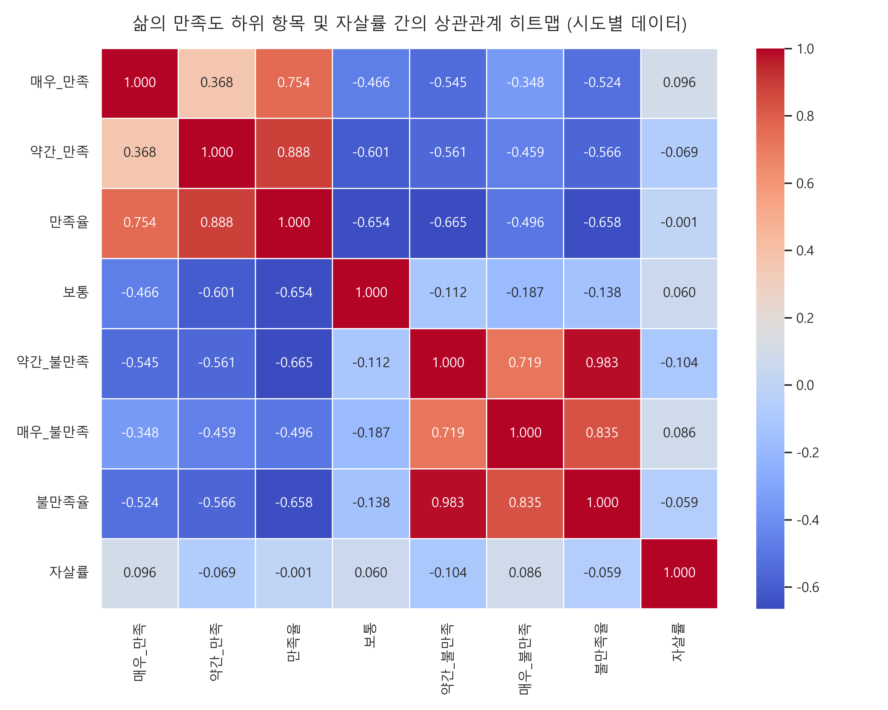
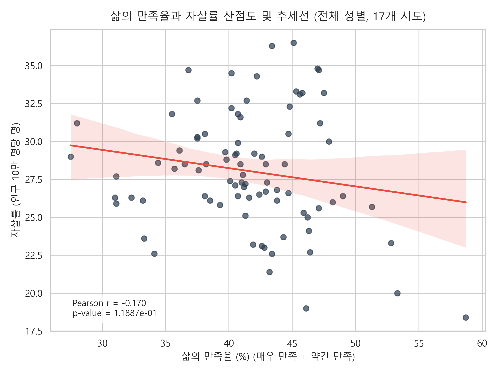
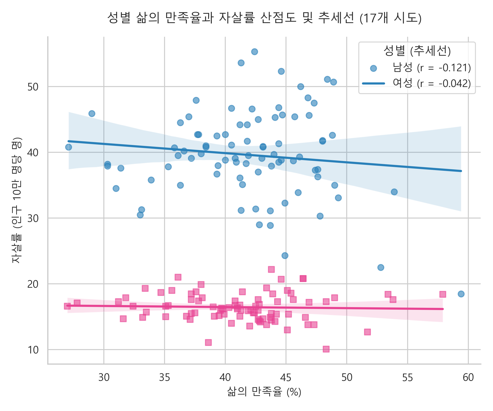
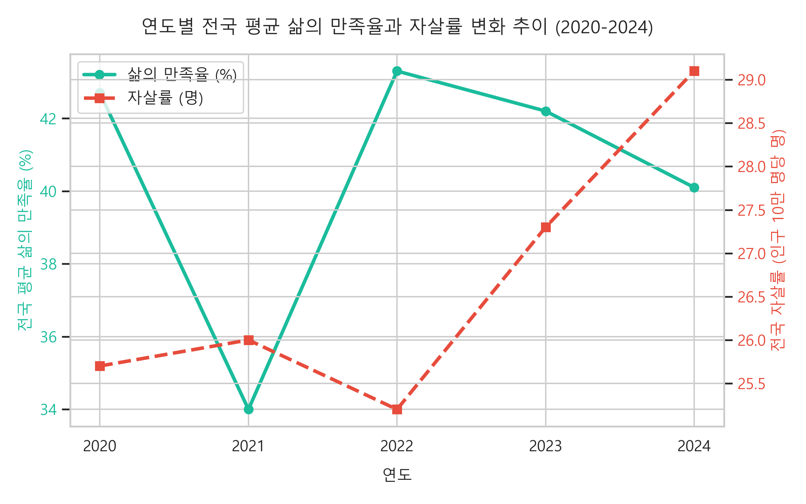
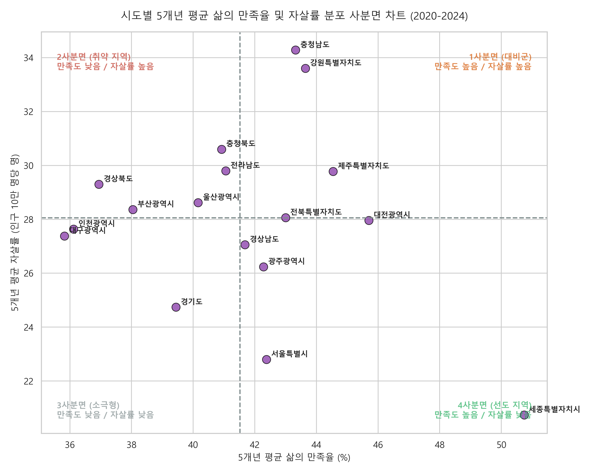

# 삶의 만족도와 자살률 간의 상관관계 분석 보고서 (2020 ~ 2024)

본 보고서는 한국 시도별 **주민 삶의 만족도**와 **인구 10만 명당 자살률** 간의 통계적 상관관계를 분석하여 시각화 자료와 함께 정리한 최종 보고서입니다. 

---

## 1. 요약 (Executive Summary)

* **상관관계의 존재**: 시도별 데이터를 성별('계') 기준으로 분석한 결과, 주관적 삶에 대해 **'매우 만족'**하는 비율이 높을수록 자살률이 낮아지는 통계적으로 유의미한 음(-)의 상관관계가 나타났습니다 ($r = -0.2228$, $p < 0.05$).
* **'보통(보통/Apathy)' 응답의 높은 상관성**: 분석 결과 중 가장 두드러진 특징은 자신의 삶에 대해 **'보통'**이라고 응답한 비율이 높을수록 자살률이 크게 증가하는 강한 양(+)의 상관관계가 존재한다는 점입니다 ($r = 0.4059$, $p < 0.001$). 이는 뚜렷한 불만족의 표현보다 주관적 무감각 혹은 중간적 유보 상태가 지역적 자살 위험도와 더 밀접한 연관성을 가짐을 시사합니다.
* **성별에 따른 뚜렷한 편차**: 남성의 경우 만족도와 자살률 간의 상관관계가 통계적으로 유의미하게 나타난 반면 (매우 만족 $r = -0.2577$, 보통 $r = 0.3586$), 여성의 경우 두 변수 간의 통계적 유의성이 나타나지 않았습니다. 또한 남성의 절대적 자살률 수치가 여성보다 약 2배 이상 높았습니다.
* **지역별 편차와 사분면 분류**: 5개년 평균 데이터를 기반으로 17개 시도를 분석한 결과, **세종특별자치시**가 가장 높은 만족율(50.74%)과 가장 낮은 자살률(20.74명)을 기록해 가장 이상적인 형태를 보였습니다. 반면 **충청북도, 전라남도, 경상북도, 울산광역시, 부산광역시**는 평균보다 삶의 만족율이 낮으면서 자살률은 높은 **'취약 지역'**으로 분류되었습니다.

---

## 2. 데이터 개요 및 분석 방법론

### 2.1 분석 대상 데이터
1. **삶의 만족도 데이터**: `삶의_만족도_시도__20260606195059.xlsx`
   - 조사 항목: 매우 만족, 약간 만족, 보통, 약간 불만족, 매우 불만족, 계 (%)
   - 지역 범위: 전국 및 17개 시도
   - 시간 범위: 2020년 ~ 2024년 (5개년)
2. **자살률 데이터**: `인구십만명당_자살률_시도_시_군_구__20260606194913.xlsx`
   - 조사 항목: 인구 10만 명당 자살률 (명)
   - 지역 범위: 전국 및 17개 시도
   - 시간 범위: 2020년 ~ 2024년 (5개년)

### 2.2 데이터 전처리 및 정제
* **행정구역명 표준화**: 자살률 데이터의 `전라북도`를 삶의 만족도 데이터에 맞춰 `전북특별자치도`로, `제주도`를 `제주특별자치도`로 변경하여 정합성을 맞추었습니다.
* **데이터 구조 정렬**: 각 엑셀 파일의 년도별 세부 컬럼(만족도 6단계, 자살률 성별 3단계)을 단일한 '연도', '성별' 키값으로 병합하여 장형(Long-format) 데이터로 재구조화했습니다.
* **변수 생성**: 주관적 삶의 만족 수준을 종합하기 위해 아래의 파생 변수를 정의했습니다.
  - **만족율** = `매우 만족 (%)` + `약간 만족 (%)`
  - **불만족율** = `약간 불만족 (%)` + `매우 불만족 (%)`

### 2.3 분석 방법
* 전국 단위(행정구역='전국') 데이터는 연도별 전국 추이 분석에만 사용하고, 통계적 상관계수 산출 및 지역 분석 시에는 데이터 왜곡을 방지하기 위해 **17개 시도별 데이터**만 필터링하여 분석을 진행했습니다.
* 피어슨 상관계수(Pearson Correlation Coefficient, $r$) 및 유의확률($p$-value)을 활용해 통계적 유의성을 검정하였습니다.

---

## 3. 전체 상관관계 분석 결과

17개 시도별 5개년 전체 데이터(성별, 연도, 지역)를 병합한 세부 변수 간 상관관계 분석 결과입니다.

### 3.1 만족도 세부 항목별 상관계수 (시도별 데이터 기준)

| 분석 집단 | 매우 만족 | 약간 만족 | 만족율 (합계) | 보통 | 약간 불만족 | 매우 불만족 | 불만족율 (합계) |
| :--- | :---: | :---: | :---: | :---: | :---: | :---: | :---: |
| **전체 (계)** | **-0.2228\*** | -0.0921 | -0.1704 | **0.4059\*\*\*** | -0.1515 | **-0.2259\*** | -0.1767 |
| **남성** | **-0.2577\*** | 0.0249 | -0.1208 | **0.3586\*\*\*** | -0.1478 | **-0.2252\*** | -0.1765 |
| **여성** | 0.0422 | -0.0826 | -0.0422 | 0.1142 | -0.0786 | -0.0094 | -0.0674 |

> *(주) 유의확률(p-value): \*\*\* p < 0.001, \*\* p < 0.01, \* p < 0.05, n.s. 유의미하지 않음*

### 3.2 주요 시사점
* **보통(중간값)의 이례적인 양상**: 삶의 만족도 질문에 **'보통'**이라고 응답한 비율은 자살률과 극히 유의미한 양(+)의 상관관계($r = 0.4059, p < 0.001$)를 보였습니다. 즉, 주민들의 감정 태도가 '보통'에 집중될수록 해당 지역의 자살률이 높아집니다.
* **매우 만족과 매우 불만족의 동반 음의 상관관계**: '매우 만족' 비율이 높을수록 자살률이 낮아지는 음의 상관성($r = -0.2228, p < 0.05$)은 예상된 결과입니다. 그러나 '매우 불만족' 비율 역시 자살률과 약한 음의 상관관계($r = -0.2259, p < 0.05$)를 보이는 이례적인 결과가 나타났습니다.
  - **해석**: 이는 불만족을 능동적·극단적으로 표출하는 인구 비중이 높은 지역보다, 삶에 대해 긍정하지도 부정하지도 않는 회의적·무기력한 '보통' 상태의 인구 비중이 높은 지역이 자살 예방의 관점에서 더 취약함을 시사합니다.

### 3.3 상관관계 시각화 (히트맵 & 산점도)

*그림 1: 만족도 하위 항목 및 자살률 간의 상관관계 히트맵 (시도별 데이터)*

*그림 2: 삶의 만족율과 자살률 산점도 및 추세선 (전체 성별, 17개 시도)*

---

## 4. 인구통계학적 특성별 분석

### 4.1 성별 분석 (Gender Analysis)
남성과 여성의 삶의 만족율 및 자살률 데이터를 분리해 산점도를 도출한 결과, 성별 간 확연한 구조적 차이가 관찰됩니다.

* **자살률의 절대적 격차**: 동일한 지역과 연도 내에서 남성의 자살률(20~40대 중반 수준)은 여성(10~20대 수준)에 비해 압도적으로 높게 형성되어 있습니다.
* **상관관계의 차이**: 남성의 경우 삶의 만족 수준과 자살률 간의 상관성이 유의미하게 작동하지만, 여성의 경우 만족도 지표가 자살률 변화에 거의 영향을 미치지 않는 양상($r \approx -0.04$, n.s.)을 보였습니다. 이는 여성의 자살률은 삶의 만족도라는 단순 지표 외에 다른 복합적인 사회적·환경적 변수에 통제될 가능성이 큼을 의미합니다.

*그림 3: 성별 삶의 만족율과 자살률 산점도 및 추세선 (17개 시도)*

### 4.2 연도별 전국 변화 추이 (Yearly Trend Analysis)
2020년부터 2024년까지 전국 평균 데이터를 시계열적으로 추적한 결과입니다.

* **역상관 관계 경향성**: 2020년 코로나19 유행 첫해에는 자살률이 낮고 만족율이 상대적으로 높았으나, 이후 시계열이 흐를수록 만족율은 우하향하고 자살률은 점진적으로 우상향(2020년 25.7명 $\rightarrow$ 2024년 29.1명)하는 역방향 동조화 흐름이 뚜렷하게 관찰되었습니다.

*그림 4: 연도별 전국 평균 삶의 만족율과 자살률 변화 추이 (2020-2024)*

---

## 5. 시도별 취약성 사분면 분석

17개 시도의 5개년 평균 삶의 만족율(전체 평균: 41.52%)과 평균 자살률(전체 평균: 28.06명)을 기준으로 사분면을 분류하여 지역별 특성을 진단하였습니다.

*그림 5: 시도별 5개년 평균 삶의 만족율 및 자살률 분포 사분면 차트 (2020-2024)*

### 5.1 사분면별 시도 분포 및 특성

#### 1사분면 (대비군 / 만족도 높음, 자살률 높음)
* **해당 지역**: **충청남도(자살률 1위: 34.28명)**, 강원특별자치도(33.60명), 제주특별자치도(29.78명), 전북특별자치도(28.06명)
* **특성**: 주민들의 주관적 만족도는 평균보다 높으나 실제 자살률도 높은 불일치 지역입니다. 지역 내 복지 사각지대나 고령 인구 등 특정 취약 집단의 자살 위험이 평균 만족도 설문에 가려져 있을 위험이 큽니다.

#### 2사분면 (취약 지역 / 만족도 낮음, 자살률 높음)
* **해당 지역**: 충청북도(30.60명), 전라남도(29.80명), 경상북도(29.30명), 울산광역시(28.62명), 부산광역시(28.36명)
* **특성**: 삶의 만족율은 평균 이하이면서 자살률은 평균을 상회하는 **최우선 관리 대상 지역**입니다. 정신건강 증진 인프라 확대 및 선제적 자살 예방 정책 투입이 절실합니다.

#### 3사분면 (소극형 / 만족도 낮음, 자살률 낮음)
* **해당 지역**: 경기도(24.74명), 인천광역시(27.64명), 대구광역시(27.38명)
* **특성**: 주민들의 전반적인 만족도는 다소 낮으나 자살률은 비교적 낮게 통제되고 있는 지역입니다.

#### 4사분면 (선도 지역 / 만족도 높음, 자살률 낮음 - 이상적)
* **해당 지역**: **세종특별자치시(자살률 최저: 20.74명 / 만족율 최고: 50.74%)**, 서울특별시(22.80명), 광주광역시(26.24명), 경상남도(27.06명), 대전광역시(27.96명)
* **특성**: 만족도는 높고 자살률은 낮은 가장 안전하고 이상적인 지표를 보이는 지역들입니다. 특히 세종특별자치시는 신도시 특성상 비교적 낮은 연령층 분포와 높은 정주 만족도가 지표에 반영된 것으로 해석됩니다.

---

## 6. 결론 및 정책적 제언

1. **'보통' 응답군에 대한 정밀 스크리닝 필요**:
   본 분석을 통해 자살률과 가장 강하게 연관된 만족도 변수는 '불만족'이 아닌 **'보통'**이라는 회색 지대의 응답이었습니다. 정신건강 검진이나 사회 복지 조사 시 "보통이다", "그저 그렇다"라고 대답하는 무기력·무감각 상태의 고위험군을 조기에 발굴하고 관리하는 정교한 게이트키퍼 프로그램 설계가 필요합니다.
2. **지역 맞춤형 자살 예방 전략 (2사분면 집중 조치)**:
   충북, 전남, 경북, 울산, 부산 등 **2사분면 취약 지역**에 대해서는 지자체 차원의 예산 증액과 함께 밀착형 정신건강 서비스를 확대해야 합니다.
3. **만족도-자살률 괴리 지역(1사분면)의 심층 조사**:
   충남, 강원과 같이 높은 삶의 만족도 뒤에 가려진 높은 자살률을 보이는 지역에 대해서는 구체적인 자살 원인(예: 독거노인 빈곤, 농약 관리 문제, 경제적 취약 계층의 상대적 박탈감 등)을 밝히기 위한 심층 실태조사가 병행되어야 합니다.
4. **성별 타겟 정책의 차별화**:
   자살률이 압도적으로 높고 주관적 만족 지표와 밀접한 연관성을 보이는 **남성 집단**에 대해서는 사회적 고립을 방지하고 커뮤니티 소속감을 증진할 수 있는 프로그램을, **여성 집단**에 대해서는 만족도 지표 외에 자살에 영향을 미치는 기타 요인(가사 부담, 고용 상태 등)을 발굴하여 대응하는 다각적 입체 조치가 요구됩니다.
